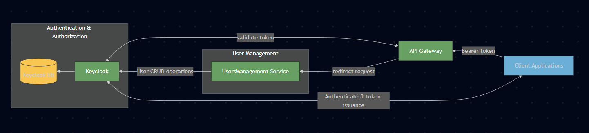

# Zeta API Gateway

A API Gateway implementation using Ocelot in .NET 8, providing robust routing, security, and monitoring capabilities for microservices architecture.

## Overview

Zeta API Gateway serves as a unified entry point for multiple microservices, handling cross-cutting concerns such as:
- Authentication & Authorization
- Rate Limiting
- Request Caching
- Load Balancing
- Service Discovery
- API Documentation
- Request/Response Transformation
- Circuit Breaking
- Request Aggregation



## Features Implemented

### 1. Authentication & Authorization
- JWT Bearer token authentication integrated with Keycloak
- Role-based access control using claims transformation
- Custom claims transformation for Keycloak roles
- Advanced role handling:
  - Realm roles transformation

### 2. Rate Limiting
- Configurable rate limiting per route
- Different rate limit configurations for various endpoints:
  - Auth endpoints: 5 requests per second
  - Admin endpoints: 30 requests per minute
  - Workspace endpoints: 100 requests per minute

### 3. Caching
- Implemented using CacheManager
- Configurable cache duration per route
- Cache regions for different types of data:
  - Users cache (15 seconds TTL)
  - Workspace cache (30 seconds TTL)

### 4. Quality of Service
- Circuit breaker pattern implementation
- Configurable timeout values
- Exception handling with retry policies
- Default configuration:
  - 3 exceptions before breaking
  - 5 seconds break duration
  - 5000ms timeout value

### 5. Service Discovery
- Consul integration for service discovery
- Dynamic service registration and discovery


### 6. Security
- CORS policy configuration
- Request logging middleware

## Custom Implementations

### Keycloak Role Transformer
The gateway includes a custom `KeycloakRoleTransformer` that enhances the security model by:

1. **Realm Role Processing**
```csharp
// Transforms Keycloak realm roles into custom claims
claimsIdentity.AddClaim(new Claim("realm_access_roles", roleName));
claimsIdentity.AddClaim(new Claim(ClaimTypes.Role, roleName));
```


2. **Error Handling & Logging**
- Robust error handling for JSON parsing
- Detailed debug logging for role transformation
- Non-blocking error handling to prevent authentication failures

## Ocelot vs YARP Comparison

### Ocelot Advantages
1. **Higher-Level Abstraction**
   - More built-in features out of the box
   - Simpler configuration through JSON
   - Integrated middleware ecosystem

2. **Rich Feature Set**
   - Built-in authentication handlers
   - Cache management
   - Rate limiting
   - Service discovery
   - Request aggregation

3. **Better Documentation**
   - Extensive documentation
   - Large community support
   - More examples and use cases

### YARP Advantages
1. **Performance**
   - Lower-level implementation
   - Better raw performance
   - Lower memory footprint

2. **Flexibility**
   - More control over the routing pipeline
   - Custom handler implementation
   - Direct access to proxy events

3. **Modern Architecture**
   - Built on modern .NET features
   - Better integration with .NET middleware
   - More extensible architecture

### Why We Chose Ocelot
1. **Feature Completeness**: Ocelot provides all required features out of the box
2. **Easy Configuration**: JSON-based configuration is easier to maintain
3. **Integration**: Better integration with existing authentication and service discovery
4. **Community**: Larger community and more resources available
5. **Time to Market**: Faster implementation of common gateway patterns

## Configuration

### Route Configuration
- Routes are defined in `ocelot.json`
- Each route specifies:
  - Downstream service details
  - Authentication requirements
  - Rate limiting options
  - Caching configuration
  - QoS settings


## Available endpoints

- `/gateway/auth/*` - Authentication endpoints
- `/gateway/users/*` - User management (Admin only)
- `/gateway/roles/*` - Role management (Admin only)
- `/gateway/workspaces/*` - Workspace management

